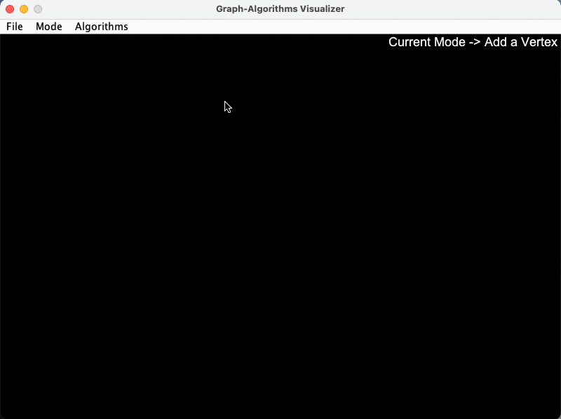

# Graph-Algorithms Visualizer

This is a handy tool to visualize common graph algorithms. It is built with Java so that you can run it on any platform.
Imagine you are a student who is learning graph algorithms. You can use this tool to visualize the algorithms and
understand them better (I would have really appreciated this when I was learning them).



## ⚡️ Get started

Make sure your system has Java (17 or above) installed. You can download OpenJDK
from [here](https://openjdk.java.net/install/).

Download the latest release from _here_. **(Coming soon, stay tuned!)**

In the meantime, you can clone this repository and build the project yourself.

```bash
git clone https://github.com/dan-koller/graph-algorithm-visualizer
cd graph-algorithm-visualizer
./gradlew build
./gradlew run
```

## 🚀 Usage

You can easily change modes using the 'Mode' menu. By default, you are in the 'Add Vertices' mode.

- Add new vertices by double-clicking on the canvas (default mode)
- Add new edges by selecting two vertices and entering the weight of the edge (adding edges mode)
- Remove vertices and edges by selecting the vertex/edge and double-clicking on it (removing mode)

### Algorithms

You can run the following algorithms on the graph:

- Breadth First Search (BFS)
- Depth First Search (DFS)
- Dijkstra's Algorithm
- Prim's Algorithm

Simply select the algorithm from the 'Algorithms' menu and select the source vertex. The algorithm will run and
visualize the process and output the result.

## 👨‍💻 Contributing

Contributions are welcome! Please open an issue or a pull request if you have any suggestions or find any bugs.

## 📝 License

This project is licensed under the MIT License - see the [LICENSE](./LICENSE) file for details.
